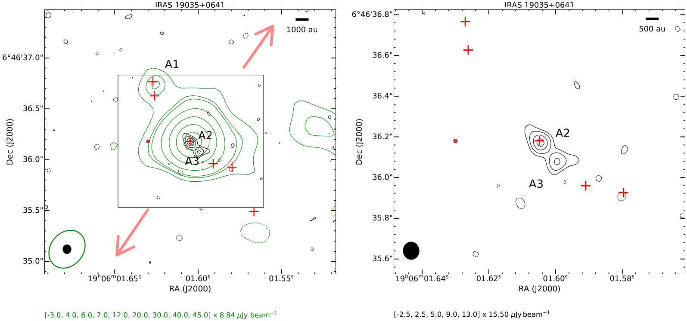

# Radio Interferometry Imaging scripts
### From the antennas to your screen ;)

I struggled a lot with imaging pipeline tools when I started working on my thesis. Very few scripts were public and most were outdated. The jump between Python2 and Python3 made everything worse. 
So I decided to make my imaging scripts public with the hopes it saves other researchers time and sweat.

The scripts here work well on Very Large Array (VLA) data, changes on the header keywords, pixel unit, etc. are needed for them to work on other data sources.

---
## 📂 Content

```
radio-imaging/
|
├── analysis/                                  # Contains data analysis scripts
│   ├── proper_motion.py                       # Calculates the spatial and angular separation between two given coordinates.
|
├── aux/                                       # Contains auxiliary scripts
│   ├── drop2axis.py                           # Modifies fits file header to make it astropy-compatible.
│   ├── hr-to-deg.py                           # Coordinate convertor (hour angle to sexagesimal and viceversa).
│
├── figs/                                      # Contains image files showing examples of what to expect from the different imaging scripts.
│   ├── continuum_color_contours.png     
│   ├── continuum_contours_2panels.png                 
│
├── imaging/                                   # Contains plotting scripts
│   ├── batch_continuum_contours_2panels.py    # Plots continuum contours from two different fits files (includes batch loading, patches, and markers).
│   ├── continuum_color_contours.py            # Plots continuum data as color scale and contours from two different fits files (includes patches and markers). 
│   ├── new_cutout_fits.py                     # Creates a smaller (in pix size) fits file.
```

---

## 📊 Example images
* **batch_continuum_contours_2panels.py**: this script was used to create the Appendix images in [Rodriguez, et al. (2026)](https://iopscience.iop.org/article/10.3847/1538-3881/ae3c07/pdf).

  


* **continuum_color_contours.py**: this script was used to create Figures 1 and 2 in [Rodriguez, et al. (2024)](https://iopscience.iop.org/article/10.3847/1538-4357/ad182f/pdf).


---

## 🪪 About Me

I'm **Tatiana M. Rodriguez**, a data professional with a Ph.D. in Physics and a knack for bringing order to chaos. I'm transitioning from academia into data engineering, where I can apply the same analytical rigor to problems that drive real business decisions. 

Let's stay in touch! Feel free to connect with me on the following platforms:

[](https://linkedin.com/in/tmrodriguez-work)
[](www.tmrodriguez.com) 
[](mailto:tatianamrodriguez.contact@gmail.com)
